# espbs

Collection of my ESP32 projects. 

The project is set up with [platformIO](https://platformio.org/), and I'm using VS-Code as a code editor.  
To reuse and maintain the base libraries, I decided to create one single project for different applications, switchable in the platform.ini.

The bundled configuration website is already part of this project (data) and stored on a separate spiffs partition on the ESP. If you want to adjust the website, please see [espjs project](https://github.com/Lillifee/espjs)  

Please let me know if you have ideas, improvements, or problems during setup.  I'm also interested in your projects and willing to add them to the repository.  If you have fancy 3d prints for an application, send me a message, and I will add them to the readme.

## Switch application

To switch the application from e.g. cube to knob

- open the platformio.ini file
- check the [board](https://docs.platformio.org/en/latest/boards/index.html) type (lolin_d32, lolin32, wemos_d1_mini32 etc.)
- comment the cube section
- uncomment the knob section

## Upload the project

You can eigher run the commands in the platformIO terminal or just use the PlatformIO tab in VSCode

### `pio run -t upload` - Build and upload the firmware

### `pio run -t uploadfs` - Build and upload the website partition

 

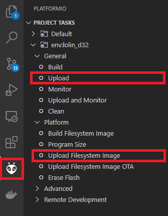

- `Upload` - build and upload the firmware (firmware.bin)
- `Upload Filesystem Image` - Upload the website partition (spiffs.bin)

## Setup

On the first startup, the ESP creates an access point called "espbs" to configure your Wi-Fi settings.
  Connect to the WLAN `espbs` with password `password`. Open the browser with http://192.168.4.1, and add your Wi-Fi settings.

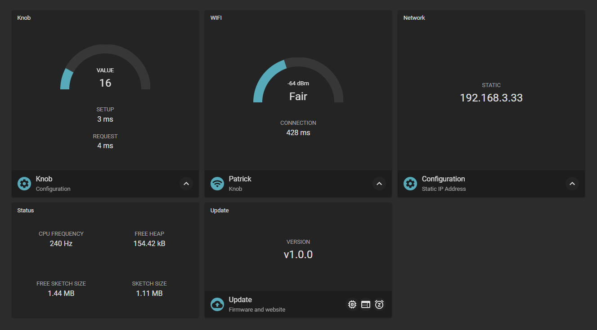

I would also recommend using a static IP address to improve the startup time of the ESP.
  You can also assign a host name. This set the MDNS host name and allows you to connect to your ESP with `http://{yourHostName}.local` in your network.

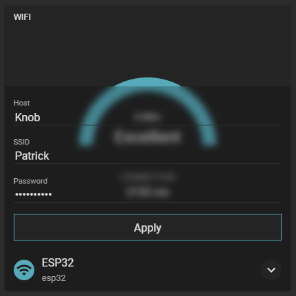

After applying the changes, the ESP will reboot and connect to your network.

 Some applications are running in deep-sleep to reduce power consumption.
If you finished the configuraiton, don't forget to send the esp to deep sleep with the sleep button in the right bottom corner of the "Update" section.

To change the settings while the esp is in sleep mode, you can press the RESET button on the ESP to start the webserver again.

The reset button will not affect your settings, so if you misconfigured your ESP (e.g. wrong Wi-Fi settings) you can erase the flash from the PlatformIO menu and start from scratch.

## Update firmware

Once the espbs is running, it's possible to update the firmware over the web interface. 
This can be quite handy if you want to update several devices on your network. e.g. multiple CO2 sensors.

- Navigate to the platformIO section in VS Code and press `Build`
- If you have done changes on the website (data) use `Build Filesystem Image`
- Once the build is finished you should find a firmware.bin and a spiffs.bin (website) in your output folder /.pio/build/{board_name}/

Open the website and upload the new firmware.

-  Press the update firmware button and choose the firmware.bin file.
-  Press the update website button and choose the spiffs.bin file.

# Applications

# Cube

The cube is a remote control for 6 different functions. It uses an MPU6050 to figure out which side is on top and send a UDP request into your network. To save the battery life, the ESP32 remains in a deep sleep until the cube gets rotated. I switch four different light scenes in my living room and control the blinds with the remaining sides.

I made this cube out of a parquet floor because I had no 3d printer back then. Send me your design's and I will add a link here.

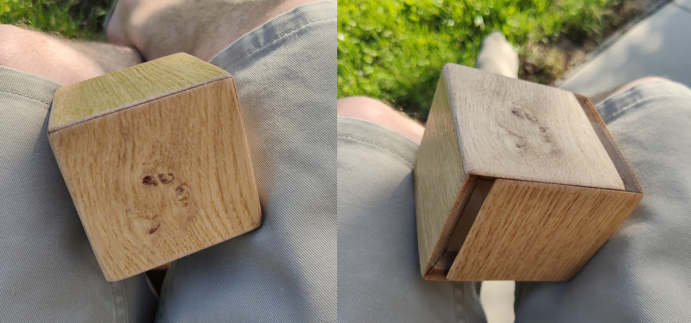

### Hardware

- MPU6050 - GY512
- ESP LOLIN32
- 3,7V 1100mAh Lithium Akku

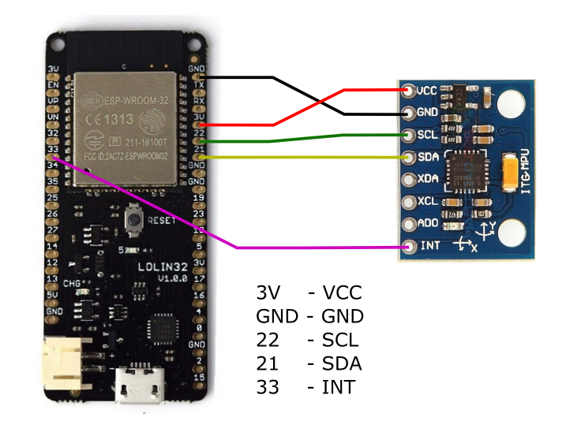

INT - is used to wake up from deep sleep. Feel free to use another pin and change it in the ./src/cube.cpp
esp_sleep_enable_ext0_wakeup(GPIO_NUM_33, 1);

### Optimization

I also found a nice article about optimizing for power consumption:  
https://bitbanksoftware.blogspot.com/2018/10/how-low-can-it-go-optimizing-for-power.html

1. Remove the voltage regulator and bridge it.
2. Remove the LED

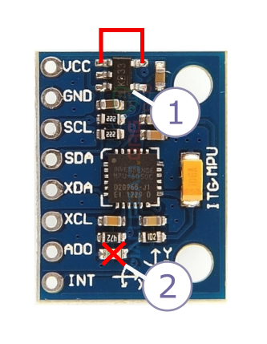

# CO2

The co2 sends the air quality as a UDP request to your home automation. I added two separate sensors to measure air quality in my living room, the MHZ-19 for the CO2 measurements, and a Bosh BME680 for the overall air quality. This application doesn't use deep sleep, and the website is running all the time. Therefore it's not necessary to send the ESP to deep sleep after configuration.

You can find the 3d printing files on https://www.prusaprinters.org/prints/47612-air-quality-sensor-case-esp32

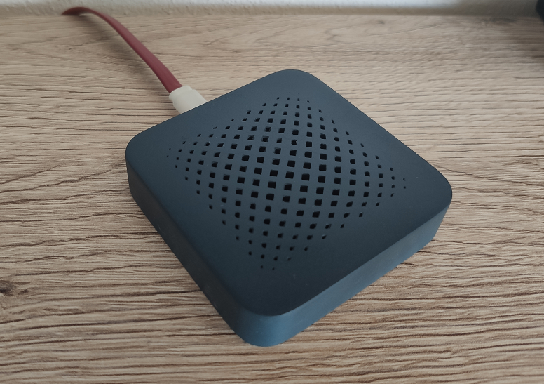

### BSEC - Bosch Sensortec

To run the BSECHelper with BME680 for additional IAQ (indoor air quality) - check the BSEC-Arduino-library.
The library is not included in this repo.
https://github.com/BoschSensortec/BSEC-Arduino-library

Copy the library into ./pio/libdeps/BSECSoftwareLibrary and enable the special build flags in the platformio.ini

### Hardware

- BME680 - pimoroni
- MH-Z19 CO2 sensor
- ESP LOLIN32

# Display

The display uses a waveshare 7.5 inch display to visualize the values of your smart home. I use it to visualize the power consumption and the air quality in the living room. To save the battery life, the ESP32 remains in deep sleep and updates in the configured interval. At the moment, the displayed values are not configurable, but you can adjust it to your needs in the lib/WaveshareHelper library.

You can find the 3d printing files on https://www.prusaprinters.org/prints/47605-e-paper-display-stand-esp32

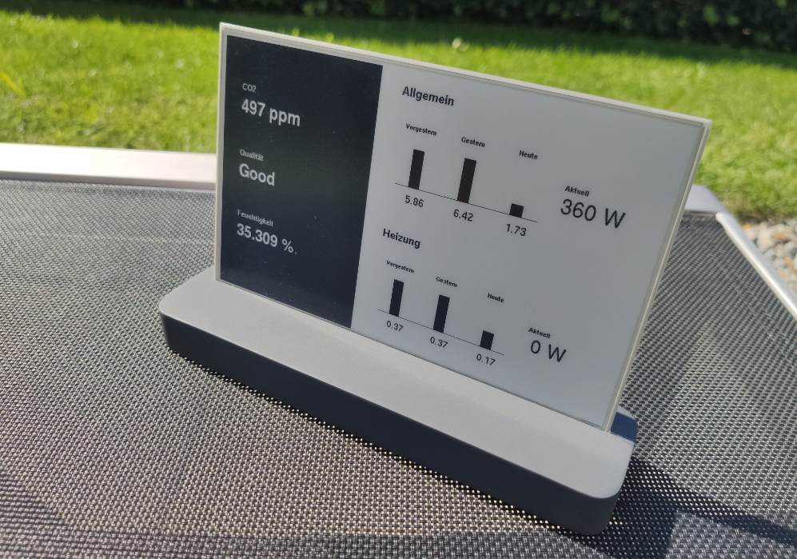

### Hardware

- ESP LOLIN32
- Waveshare 7.5 inch e-paper display
- 3,7V 1100mAh Lithium Akku

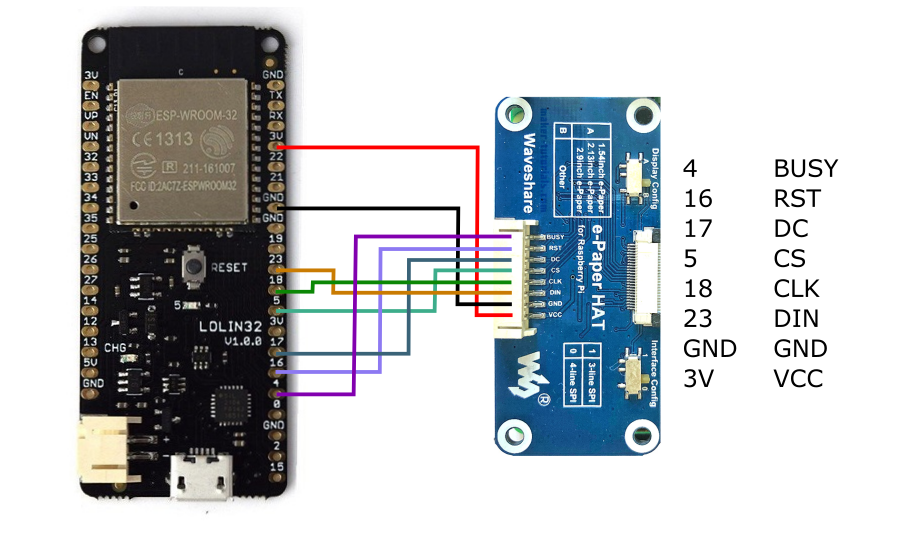

# Knob

The knob uses a rotary encoder to e.g. dim the light over Wi-Fi.
To save the battery life, the ESP32 remains in a deep sleep until the knob gets pressed. On rotation, the current value is sent as a UDP packet into the network to my home automation server. After a few seconds without value change, the ESP goes back to deep sleep.

You can find the 3d printing files on https://www.prusaprinters.org/prints/47614-wifi-knob-esp32

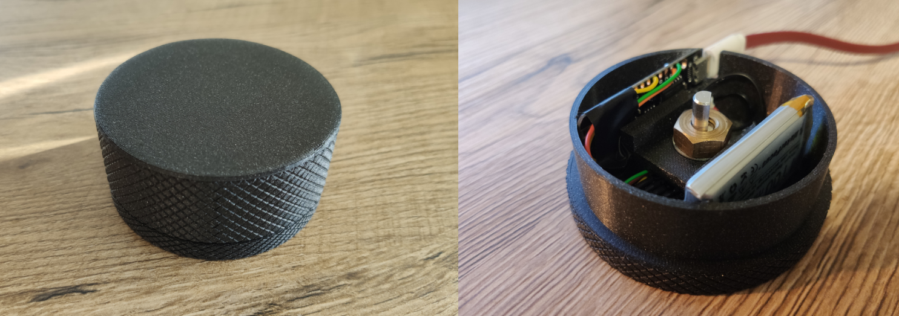

### Hardware

- ESP LOLIN32 lite
- Rotary encoder
- 3,7V 1100mAh Lithium Akku

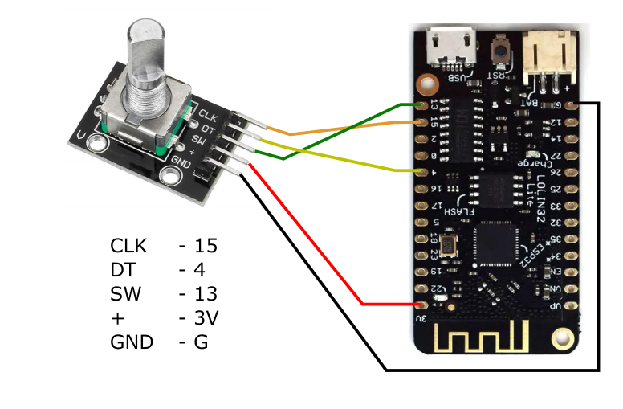

Feel free to change the wiring in ./lib/KnobHelper/KnobHelper.h and the wakeup pin in ./src/knob.cpp
